## 2. Entrega un diagrama o esquema y define el modelo físico. Debes incluir: 

1.Las colecciones y el propósito de cada una.

2.Documentos de ejemplo en JSON o BSON para todas las colecciones principales.

3.Al menos una decisión de incrustación y una de referencia, justificando tamaño, frecuencia de lectura, cardinalidad y posibilidad de actualización.

4.La estrategia para identificadores, fechas, estados y campos opcionales.

5.Los límites del modelo: tamaño máximo del documento, crecimiento de arrays, duplicación, consistencia y operaciones que resultarían incómodas.

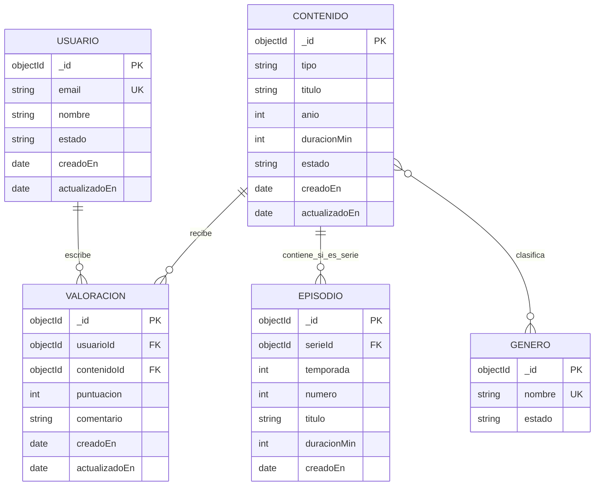

## 3. Implementar validación e índices

**Incluye scripts reproducibles para crear las colecciones con validación mediante $jsonSchema. La validación debe comprobar, como mínimo, tipos, campos obligatorios, enumeraciones y una restricción de rango o formato.**

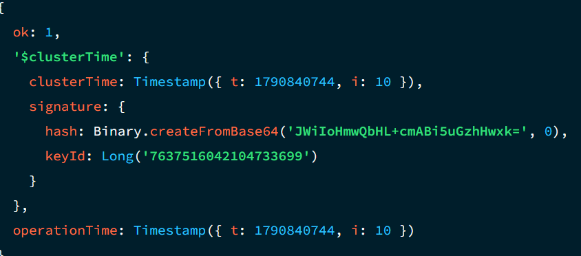

**Define índices justificados a partir de las preguntas de negocio:**

1.Al menos tres índices, incluyendo uno compuesto.

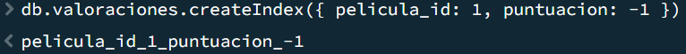

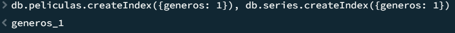

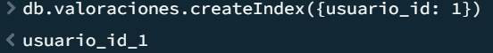

**2.Si el escenario lo necesita, un índice de texto o geoespacial.**

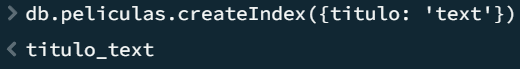

Para este escenario no necesitamos un índice geoespacial porque no trabajamos con coordenadas

**3.Para cada índice, explica qué consulta acelera, el orden de sus campos y su coste en escrituras y almacenamiento.**

El primer índice sirve para cuando un usuario busque una película le muestren las películas ordenadas de manera descendente por el id, el segundo es para mostrar las peliculas que tienen el género que se ha buscado y el último es para que se registren cuantas valoraciones hace cada usuario

**4.Evidencia el plan de una consulta con explain("executionStats") antes y después, o explica por qué no es posible comparar ambos casos.**

| Métrica      | Antes  | Después |
|--------------|:------:|:-------:|
| nReturned    |   1    |    1    |
| executionTimeMillis| O ms | 1 ms |
| totalKeysExamined | 0 | 1 |
| totalDocsExamined | 1 | 1 |
|  Plan | Collscan | Ixscan |

## 4. Resolver consultas y una agregación compleja (90 minutos)

### Implementa consultas que cubran las preguntas de negocio. Debes incluir:

**1.Inserción, actualización parcial y eliminación o desactivación lógica.**

## Inserción

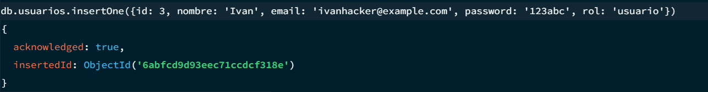

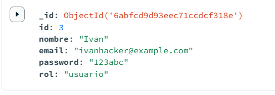

## Actualización parcial

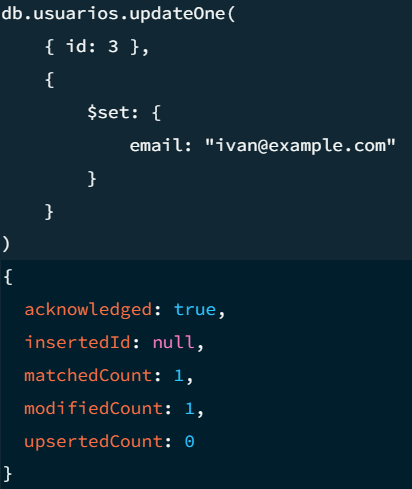

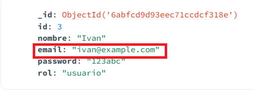

## Desactivación lógica

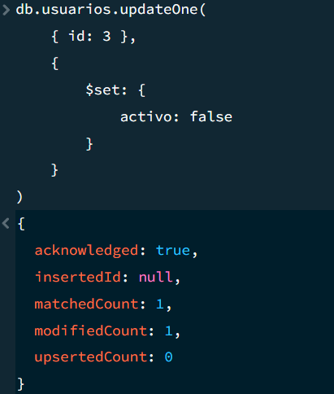

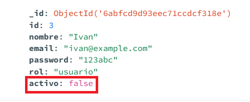

**2.Filtros combinados, ordenación y paginación estable con limit y un criterio de ordenación.**

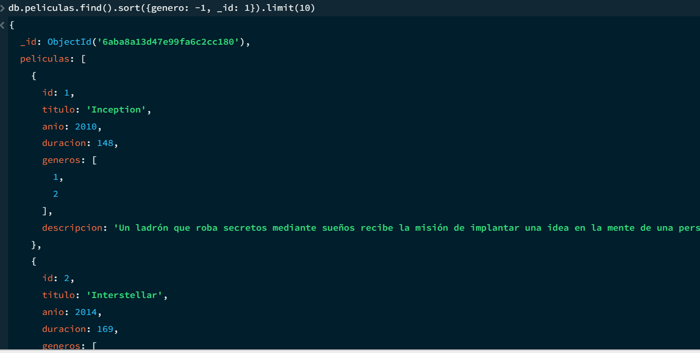

**3.Una consulta que use una referencia mediante $lookup, si el diseño contiene referencias.**

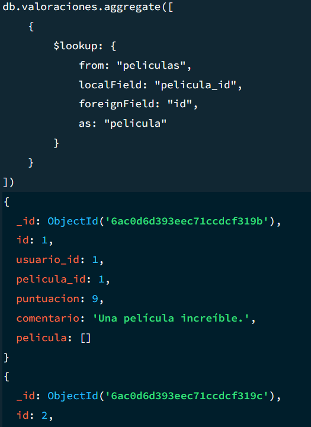

Para que la consulta funcione tiene que haber datos en las colecciones que vas a usar porque sino no funciona

**4.Una agregación compleja de al menos cuatro etapas, que incluya dos de estas operaciones: $group, $lookup, $unwind, $facet, $bucket, $setWindowFields o una operación geoespacial.**

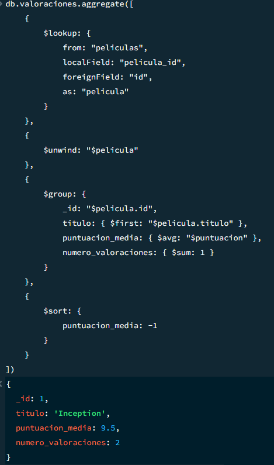

**5.Una explicación del resultado y de cómo cambiaría el coste al aumentar los datos.**

## 5. Copias de seguridad, seguridad y límites (60 minutos)

**Documenta**:

1.Un procedimiento de copia y restauración con mongodump/mongorestore o la alternativa equivalente de Atlas.

## Copia de la DB peliculas

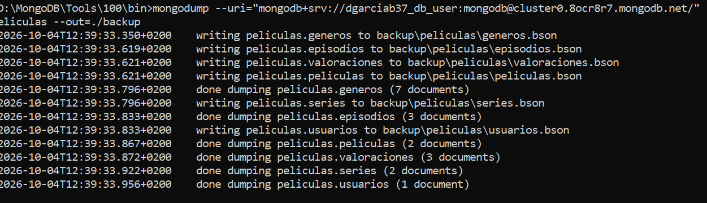

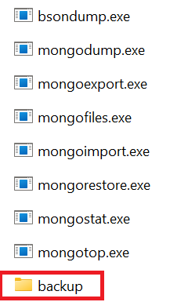

## Restauración de la DB peliculas

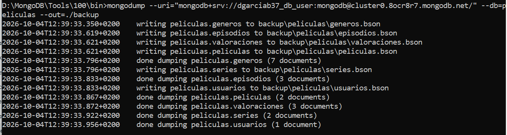

2.Usuarios, roles y permisos mínimos para la aplicación y para administración.

**Usuario y administrador**

3.Qué datos deben cifrarse, anonimizarse o excluirse de los entornos de prueba.

**La contraseña y el id del usuario no son necesarios**

4.Dos situaciones en las que MongoDB no sería la mejor opción o exigiría complementarse con otro sistema.

**Sistemas bancarios o financieros: requieren una alta consistencia y transacciones complejas, por lo que una base de datos relacional puede ser más adecuada.**

**Análisis masivo de datos: cuando se necesitan analizar grandes volúmenes de datos históricos, MongoDB puede complementarse con sistemas como Spark o un data warehouse.**

5.Qué datos históricos conservarías, archivarías o eliminarías y con qué criterio.

**El correo lo eliminaría porque si quiero mostrar las valoraciones de los usuarios de una película solo habría que mostrar el nombre del usuario, el correo no es necesario (además es un dato sensible)**